# ReadMe
*Because I changed the name of file and uploaded my coding in different times with differnent ways, so it seems strange in my original repository, so I create a new repository to upload, and there are already 5 commits in my original repository, here's the link: https://github.com/TheMST33/Zhihao-Zhang.git. Really sorry for that. 
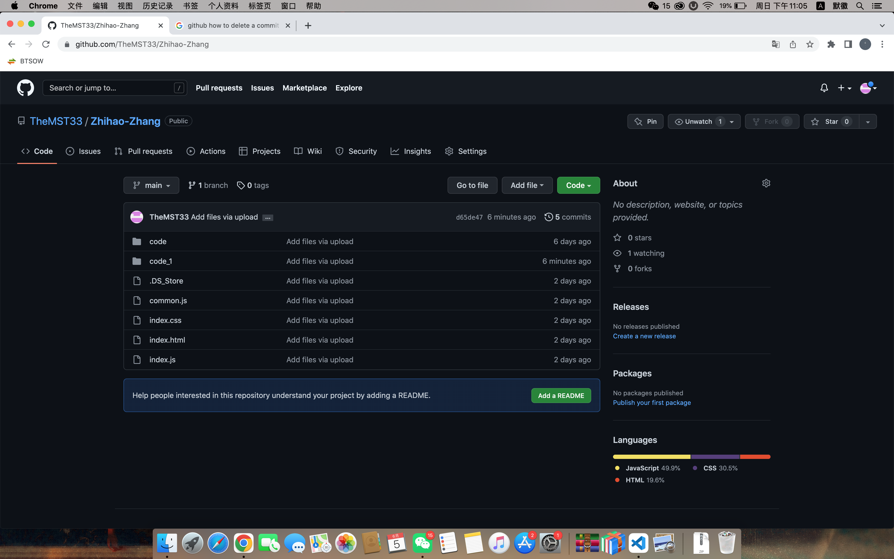

(There are some problems with my design pitch, which is A2, so I havn't got the specific feedback and marks of that, and I don't know what's the problem of my design pitch. I asked before but just told me keep focusing on coding. Therefore I just keep using what I have designed in A2  )

## Brief introduction of my web
* For the functions in my design, the main pages are task management and content management, which are the pages "Calendar" and "Details". All the functions are contained in these two pages.
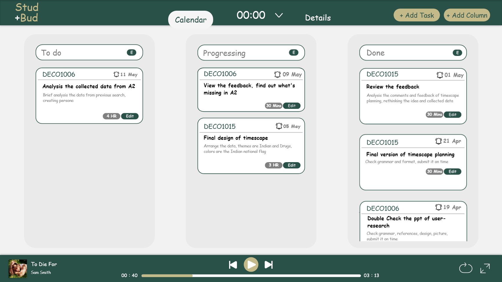
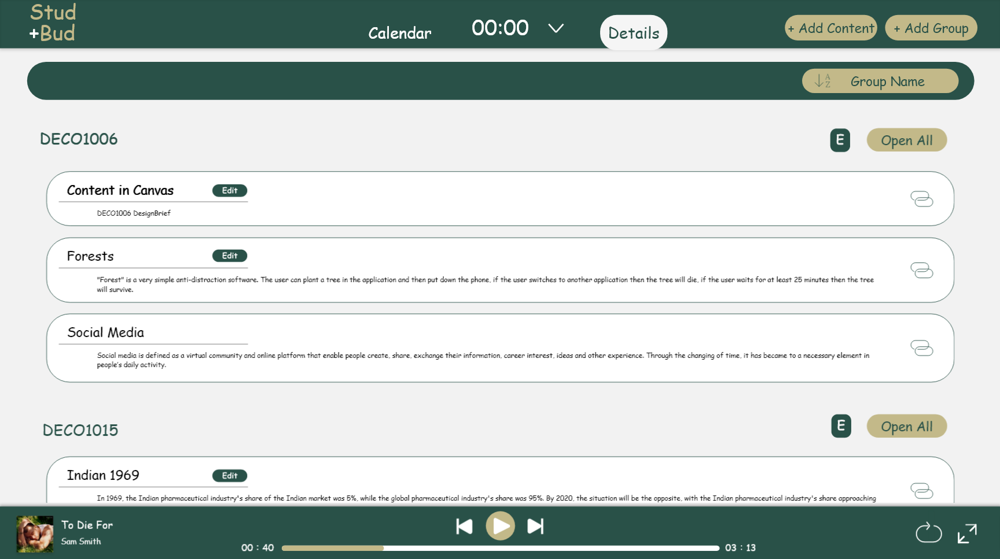
* For the part of music player, I setted it in the bottom of two main pages, shows the simple function of controling the music player and music list. In the bottom right corner, there is a expand button of music list.
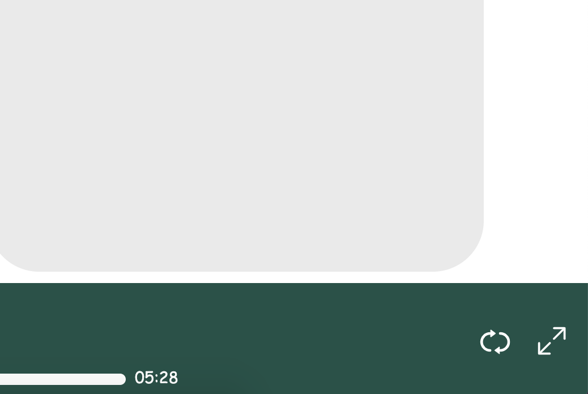
* And also, in the top middle in the nav bar, I placed the timers in there, showing time and the small triangle button.
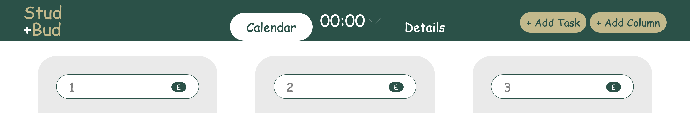

## Using Guide
* In the main pages, which are task managment and content management. In the both pages, user need to add the column/group first, then adding task/content. When enter the web in the first time, the pages might be empty, in order to let user adding their own things.
* After adding the things in the two main pages, user can edit on them with click the small button "E" or "Edit", depends on the place they want to change. Once they clcik them, the details of current column/group/task/content will be shown to them, and they can change the contents of them or just delete them.
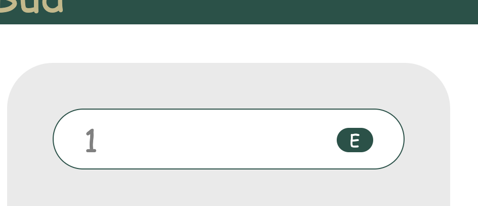
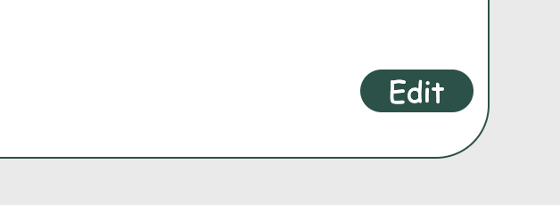

* For music player, user need to click the right bottom button to expand the page of music player, which is shown as a pop-up. User can see the music list and details of music.
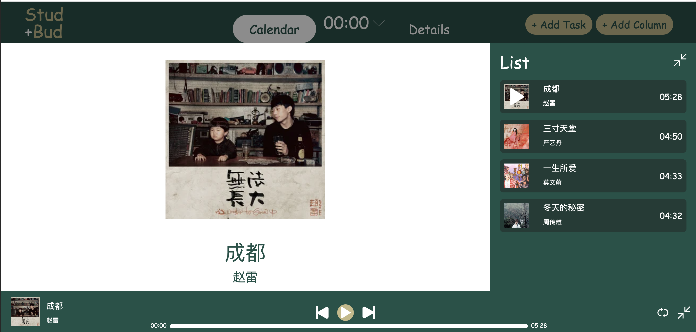

* There are two timers in the web, one is normal timer, counts from 0 and the other one is pomodoro timer, counts down from selected time. In normal timer, user can control the timer with start, pause and reset. In pomodoro timer, user need to select each work and break time. Then choose the loop times, after pressing "start", the timer will automatically counts down, and counts the next break or work time when the previous selected time finish. User can click the small inverted triangle besides the title of timer to change the way of timing. (When user click the 'end' button in the pomodoro timer, it will back to time setting page, which helps to ask user pay attention on their work, do not stop the timing easily as they need to recount the time)
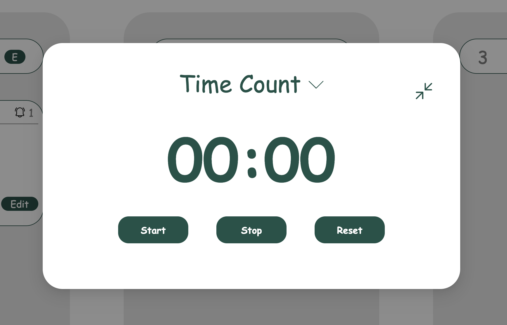
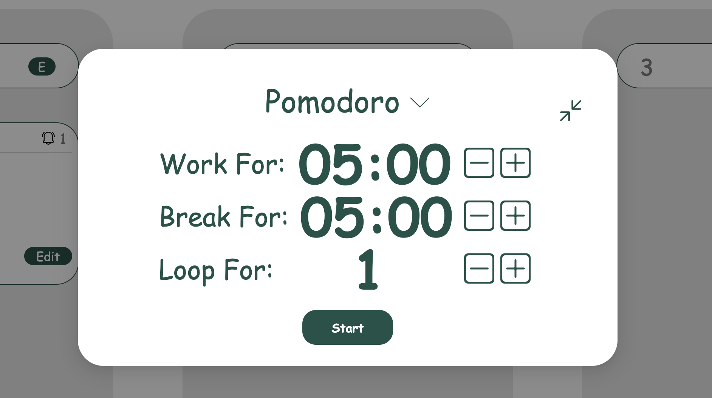

* The basic functions contained in my design are task management and content management, two timers and a music player. In order to help me arrange my coding, I separate each functions contained in my design partly, and leave the coding of main elements and music player in the main index. So the main docs of my design are the thress .html, .css and .js in the file. Other coding are separate into each small functional file.

## Changes
> When revirewing my original design and check the functional specification, I found that in the content and details page, I forgot to add edit function on each tasks and contents, So I added them in this time, which are the "Edit" and small "E" I mentioned before.

> And also, there's a small change in the nav bar, that I have moved the place of calendar and details button to the middle, beside the timer, from the left side of nav bar. I asked my friend to review my design before, as I havn't got feedback for my A2. And he claimed that moving to the middle may helps user separate two pages clearly.
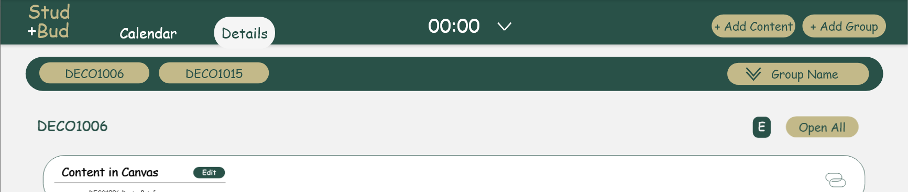
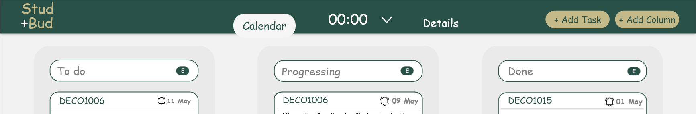

## During design/coding
> When I tried to make buttons functional, it was hard to combine each parts of a button together, especially for the buttons in music player, as they are mainly lines. So I tried to make the buttons into svg, then adding functions on them, which helps me a lot to save my time and decreasing the diffculties.
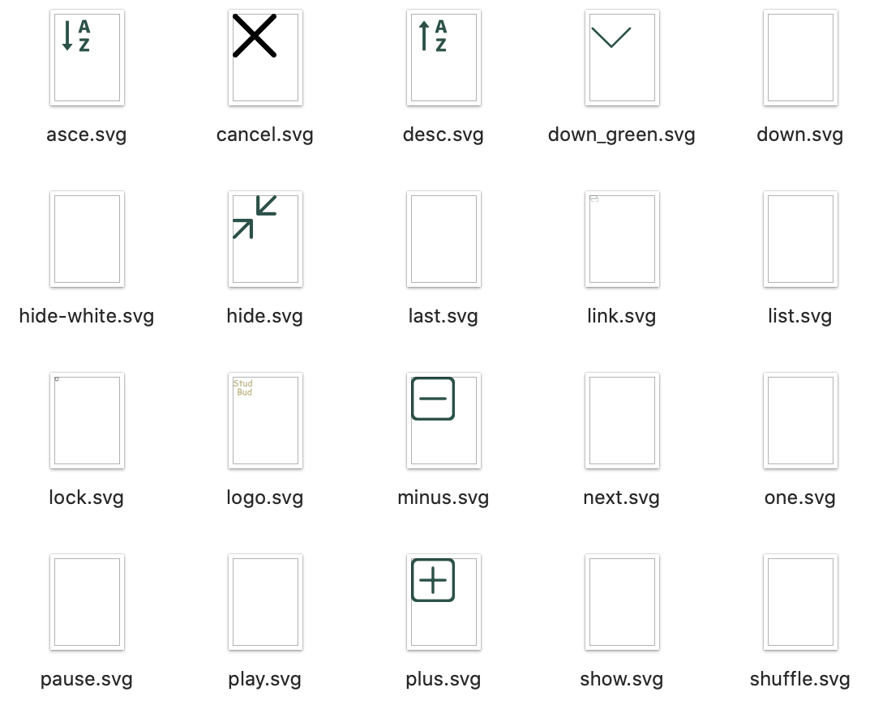

>During the process of design, I was tried to changed the color of background of my web into other colors, but I fought that I need to keep the design principle, which is emphasis, to highlight the fonts as they can easily be indentifies by user. So I keep the background color in white, which is clean and easily shows the fonts. Also for the contents contained in each column and group, I setted the font of each part with different sizes, in order to highlight the important things like topic and group name.

*Btw, there's one commit I tried to upload on github but I forgot to save the change of commit, around 25 of May. I only have a screenshot of main page about that, and in that time, the basic logic part had finished, the layout of two timer had finished, and missing the part of music player.
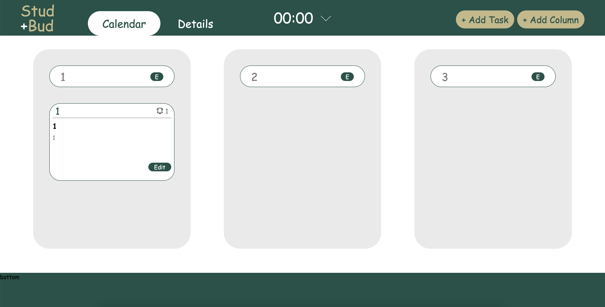

## Reference
*Chapman, C. (n.d.). Breaking Down the Principles of Design (with Infographic). Retrieved from https://www.toptal.com/designers/gui/principles-of-design-infographic#:~:text=There%20are%20twelve%20basic%20principles,movement%2C%20variety%2C%20and%20unity.

*Travercy Media. (2021, April 11). Build a Music Player | Vanilla JavaScript [Video file]. Retrieved from https://www.youtube.com/watch?v=QTHRWGn_sJw

*Programming with Lam. (2021, October 16). Build a Music Player with JavaScript [Video file]. Retrieved from https://www.youtube.com/watch?v=oscPp3KghS8

*KDS Coder. (2022, January 31). Create A Music Website Using HTML CSS JAVASCRIPT | Add Music In HTML Website [Video file]. Retrieved from https://youtu.be/JRta1R8lt8o

*learn-webdev. (2020, May 16). Pomodoro Timer | Javascript Beginner Project Tutorial[Video file]. Retrieved from https://www.youtube.com/watch?v=vAEG6OVCass

*Scrimba. (2021, Sep 18). Live-code a JavaScript pomodoro timer with us | HTML | CSS | JavaScript [Video file]. Retrieved from https://www.youtube.com/watch?v=puovsvSt79E

*Wout Van Damme. (2020, August 15). Making a pomodoro timer from scratch with javascript & HTML/CSS during a pomodoro break.[Video file]. Retrieved from https://www.youtube.com/watch?v=tsK-C9voU0Y

*艾恩小灰灰. (2022, April 21). HTML5+CSS3+JS小实例：迷你音乐播放器（上） [Video file]. Retrieved from https://www.bilibili.com/video/BV1di4y127U2?spm_id_from=333.337.search-card.all.click

*喵不傲. (2021, April 04).[JS计时器]十分钟再写一个计时器！ [Video file]. Retrieved from https://www.bilibili.com/video/BV19Z4y1F7Ay?spm_id_from=333.337.search-card.all.click

*Adnan Afzal (2021, June 17). Create Your Own Task Management and Time Tracking Script - HTML and Javascript [Video file]. Retrieved from https://www.youtube.com/watch?v=hBkoh3C-jxk

*Levi Janssen (2020, January 7). I Made a Project Management Web App
 [Video file]. Retrieved from https://www.youtube.com/watch?v=Ss4_1Lhsr6k

*Tyler Potts (2021, October 2). Build a Todo list app in HTML, CSS & JavaScript in 2021 | JavaScript for Beginners tutorial [Video file]. Retrieved from https://www.youtube.com/watch?v=MkESyVB4oUw

*技术蛋老师 (2020, July 4). JavaScript 拖拽功能 - Web前端工程师面试题讲解 [Video file]. Retrieved from https://www.bilibili.com/video/BV1hf4y117Dp?spm_id_from=333.337.search-card.all.click

*it-carry (2020, August 2). 【html+css+js】js拖拽效果，鼠标拖着盒子跑 [Video file]. Retrieved from https://www.bilibili.com/video/BV1cK4y1v7Mg?spm_id_from=333.337.search-card.all.click

*W3c schools (n.d).  Retrieved from https://www.w3schools.com/

*平头哥→_→ (2020, March 22). JS定时器实现倒计时（含基础知识. Retrieved from https://blog.csdn.net/weixin_42207353/article/details/105024250?ops_request_misc=&request_id=&biz_id=102&utm_term=js%E5%80%92%E8%AE%A1%E6%97%B6%E5%99%A8&utm_medium=distribute.pc_search_result.none-task-blog-2~all~sobaiduweb~default-1-105024250.142^v11^control,157^v13^control&spm=1018.2226.3001.4187

*�Ticardo� (2021, January 23). Js简单实现音乐播放器. Retrieved from https://blog.csdn.net/weixin_43802072/article/details/113060798?ops_request_misc=%257B%2522request%255Fid%2522%253A%2522165443228416781667827091%2522%252C%2522scm%2522%253A%252220140713.130102334..%2522%257D&request_id=165443228416781667827091&biz_id=0&utm_medium=distribute.pc_search_result.none-task-blog-2~all~sobaiduend~default-1-113060798-null-null.142^v11^control,157^v13^control&utm_term=js+%E9%9F%B3%E4%B9%90%E6%92%AD%E6%94%BE%E5%99%A8&spm=1018.2226.3001.4187

*阿源不秃，天理难容 (2020, April 12). flex 弹性盒子元素自适应占满一行/列. Retrieved from https://blog.csdn.net/weixin_42945998/article/details/105475101?ops_request_misc=%257B%2522request%255Fid%2522%253A%2522165443238816782425184293%2522%252C%2522scm%2522%253A%252220140713.130102334.pc%255Fall.%2522%257D&request_id=165443238816782425184293&biz_id=0&utm_medium=distribute.pc_search_result.none-task-blog-2~all~first_rank_ecpm_v1~rank_v31_ecpm-3-105475101-null-null.142^v11^control,157^v13^control&utm_term=%E7%9B%92%E5%85%83%E7%B4%A0&spm=1018.2226.3001.4187

*KodeBase (2020, May 22). How to Open URL on Button Click in javascript [Video file]. Retrieved from https://www.youtube.com/watch?v=4KTB0MPHHrg

*HowToCodeSchool (2020, October 12). Open Link in New Tab using JavaScript [Video file]. Retrieved from https://www.youtube.com/watch?v=R0fveA1xArM

*Web Dev Simplified (2019, April 21). BBuild a Popup With JavaScript [Video file]. Retrieved from https://www.youtube.com/watch?v=MBaw_6cPmAw

*Codingflag (2020, February 18). How to Create Simple Popup Box / Modal using HTML CSS & JavaScript [Video file]. Retrieved from https://www.youtube.com/watch?v=iE_6pQ3RlZU

*Tony Teaches Tech (2021, August 31). How to do JavaScript Popups (alert, confirm, prompt examples)[Video file]. Retrieved from https://www.youtube.com/watch?v=bNtyTGBtbK4

*ScoreShala (2020, October 12). Program to Sort Words in Alphabetical Order in Javascript [Video file]. Retrieved from https://www.youtube.com/watch?v=FgpkEbZIvjY

